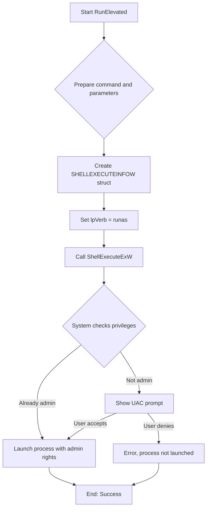
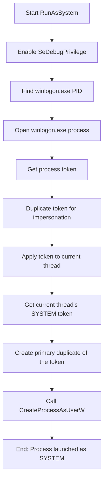
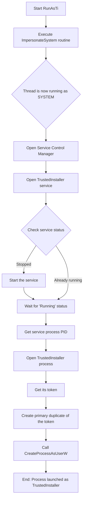
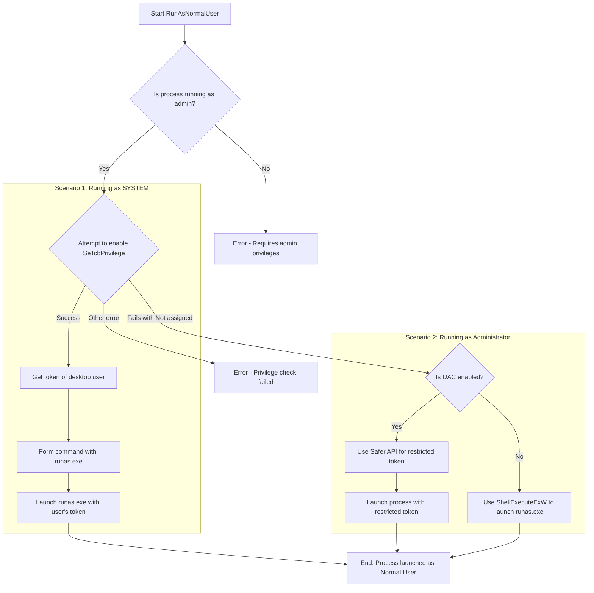

# miniRunAsTI

Yet another RunAsTI. Part of RebuildTool

## How it works

### RunElevated (RunAs) mode

    
Show

### System mode

    
Show

### TrustedInstaller (RunAsTi) mode

    
Show

### RunAsNormalUser mode

    
Show

